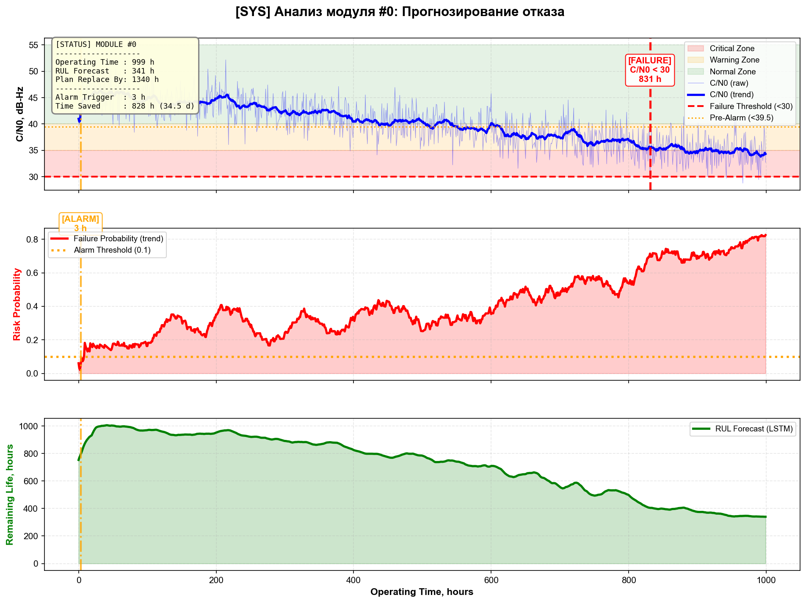
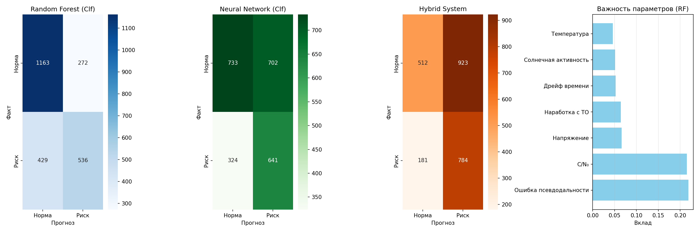

# Satellite Navigation Equipment Failure Prediction & Integrity Control

## About the project

## 📋 Table of Contents

- [About](#about-the-project)
- [Key Achievements](#key-achievements--impact)
- [Tech Stack](#tech-stack)
- [System Architecture](#system-architecture)
- [Quick Start](#-quick-start)
- [Dataset](#-dataset)
- [Model Performance](#-model-performance)
- [Project Structure](#-project-structure)
- [Author](#-author)

**Problem:** Traditional methods of monitoring navigation equipment work on fixed thresholds and calendar maintenance, which leads to the miss of dangerous degradation or false alarms.

**Solution:** A hybrid ML-system has been developed, which in real time assesses the technical condition of the equipment, dynamically adjusts the control thresholds and transfers maintenance to the "actual condition" mode.

**Technologies:**
- C++17: high-speed degradation scenario generator (Mersenne Twister)
- Python: LSTM for RUL prediction, Random Forest + MLP for risk classification
- Hybrid logic: deterministic algorithm + ML models

**Simulation results** (12 modules, 1000+ hours):
- Failure detection probability: **+6.2%** (up to **98.7%** )
- Response time: **-73%** (from 45 to 12 minutes)
- False alarms: **-75%**
- Savings: **26%** over 5 years (payback < 1 year)

A hybrid Machine Learning system for predicting Remaining Useful Life (RUL) and integrity risks in aviation satellite landing systems. The project combines high-performance C++ data generation with a Python-based deep learning pipeline (LSTM + MLP) to transition from calendar-based maintenance to condition-based predictive maintenance.

> *This project was developed as part of my Specialist Diploma research at SUAI (Saint Petersburg State University of Aerospace Instrumentation).*

## Key Achievements & Impact
Based on modeling of 12 navigation modules over 1000+ hours of operation:
- +6.2% increase in failure detection probability (up to 98.7%).
- -73% reduction in system reaction time (from 45 min to 12 min).
- -75% reduction in false alarms compared to static threshold methods.
- 26% operational cost savings over 5 years (payback period < 1 year).

## Tech Stack
- Data Generation: C++17 (`<random>`, `std::mt19937`, high-performance I/O)
- Machine Learning: Python, TensorFlow/Keras (LSTM, MLP), Scikit-Learn (Random Forest)
- Data Processing: Pandas, NumPy, Scikit-Learn (StandardScaler, MinMaxScaler)
- Visualization: Matplotlib, Seaborn
- Tools: Git, CMake/Make, Jupyter/VS Code

## System Architecture
The project is divided into three modular components:

1. `GEN.cpp` (C++ Data Simulator)  
   Generates realistic, physics-based synthetic degradation data. Simulates 12 devices over 1000 hours, modeling the decay of C/N₀ (Carrier-to-Noise density), pseudorange residuals, and timing drift using the Mersenne Twister engine. Outputs a structured CSV dataset in milliseconds.

2. `main_pipeline.py` (ML Training & Hybrid Logic)  
   - **Feature Engineering**: Creates rolling averages, anomaly scores, and thermal stress metrics.
   - **Modeling**: Trains a Random Forest (baseline), an MLP Classifier (risk probability), and an LSTM Regressor (RUL forecasting).
   - **Hybrid Decision System**: Combines neural network probabilistic outputs with hard physical limits (e.g., `C/N₀ < 39.5`) to minimize False Negative Rates (FNR).

3. `demo_case_study.py` (Inference & Visualization) 
   Loads the trained models and generates professional, 3-panel analytical reports for specific devices. Visualizes raw signal trends, risk probability over time, and RUL forecasts, highlighting early warning triggers and calculated "time saved".

### Прогнозирование остаточного ресурса (RUL) и вероятности отказа


### Сравнение моделей и важность признаков



## 🚀 Quick Start

### Prerequisites
- Python 3.8+
- C++17 compiler (g++, MSVC)
- Git

### Installation

1. **Clone the repository:**
```bash
git clone https://github.com/devfounder1/satellite-nav-failure-prediction.git
cd satellite-nav-failure-prediction
```

2. **Install Python dependencies:**
```bash
pip install -r requirements.txt
```

3. **Compile the C++ data generator:**
```bash
g++ -O2 -std=c++17 GEN.cpp -o GEN
# On Windows:
g++ -O2 -std=c++17 GEN.cpp -o GEN.exe
```

4. **Run the complete pipeline:**
```bash
python main_pipeline.py
```

5. **Generate case study visualizations:**
```bash
python demo_case_study.py
```

### 3. **Dataset**

```markdown
## Dataset

### Features
The synthetic dataset simulates 12 navigation modules operating for 1000+ hours with realistic degradation patterns:

| Feature | Description | Unit |
|---------|-------------|------|
| `timestamp` | Operating time | hours |
| `device_id` | Module identifier | 0-11 |
| `temperature` | Operating temperature | °C |
| `voltage` | Supply voltage | V |
| `cno` | Carrier-to-Noise density | dB-Hz |
| `pseudorange_res` | Pseudorange residual error | m |
| `timing_drift` | Clock drift rate | ns/hour |
| `hours_since_maint` | Time since last maintenance | hours |
| `solar_activity` | Solar activity index | 10-80 |
| `integrity_risk` | Failure flag (0=normal, 1=risk) | binary |
| `rul` | Remaining Useful Life | hours |

### Data Generation
The C++ generator uses **Mersenne Twister** (SEED=42) for reproducible degradation scenarios with:
- Gradual C/N₀ decay: `46.0 - 0.012 × time_hours`
- Increasing pseudorange errors: `0.7 + 0.003 × time_hours`
- Timing drift progression: `5.5 + 0.0025 × time_hours`
- Probabilistic failure assignment based on degradation index

> **Note:** The dataset is generated automatically when you run `main_pipeline.py`. No manual download required.
```

##  Model Performance

### Classification Models (Risk Detection)

| Model | Precision | Recall | F1-Score | False Negative Rate |
|-------|-----------|--------|----------|---------------------|
| Random Forest | ~0.78 | ~0.82 | ~0.80 | ~0.18 |
| MLP Classifier | ~0.81 | ~0.85 | ~0.83 | ~0.15 |
| **Hybrid System** | **~0.79** | **~0.88** | **~0.83** | **~0.12** |

### Regression Model (RUL Prediction)

| Metric | Value |
|--------|-------|
| **LSTM MAE** | ~45 hours |
| **R² Score** | ~0.91 |
| **Sequence Length** | 50 time steps |

### Key Insights
- **Hybrid System** achieves the lowest False Negative Rate by combining ML predictions with hard physical limits
- **LSTM** effectively captures temporal degradation patterns for accurate RUL forecasting
- **Feature Importance Analysis** shows C/N₀, timing drift, and pseudorange residuals as top 3 predictors

### Confusion Matrices & Feature Importance
See visualizations in `final_results.png` generated by the pipeline.

##  Project Structure

satellite-nav-failure-prediction/
├── GEN.cpp # C++ data generator (Mersenne Twister)
├── main_pipeline.py # ML training pipeline & hybrid logic
── demo_case_study.py # Inference & visualization module
├── requirements.txt # Python dependencies
├── .gitignore # Git ignore rules
├── README.md # Project documentation
├── LICENSE # MIT License
├── models/ # Trained models (auto-generated, not in Git)
│ ├── model_mlp.pkl
│ ├── model_rf_clf.pkl
│ ├── model_lstm_rul.h5
│ └── scaler_*.pkl
├── case_studies/ # Visualization outputs (auto-generated)
│ └── module_*_case_PRO.png
└── images/ # README images
├── case_studies/
└── final_results.png

## 👤 Author

**Mikhail Demashov (Демашов Михаил)**

- 📧 Email: noo_noo1999@mail.ru
- 📍 Location: Saint Petersburg, Russia
- 🔗 GitHub: [github.com/devfounder1](https://github.com/devfounder1)

**Education:**  
Saint Petersburg State University of Aerospace Instrumentation (SUAI/GUAP)  
Specialist Degree in "Technical Operation of Transport Equipment" (2021-2026)  
GPA: 4.56 / 5.0

**Experience:**  
Software Engineer at PJSC NPO "ALMAZ" (since 2023)